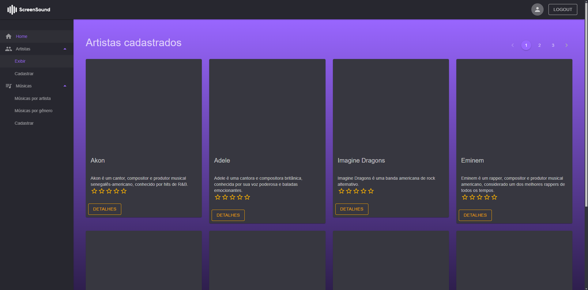
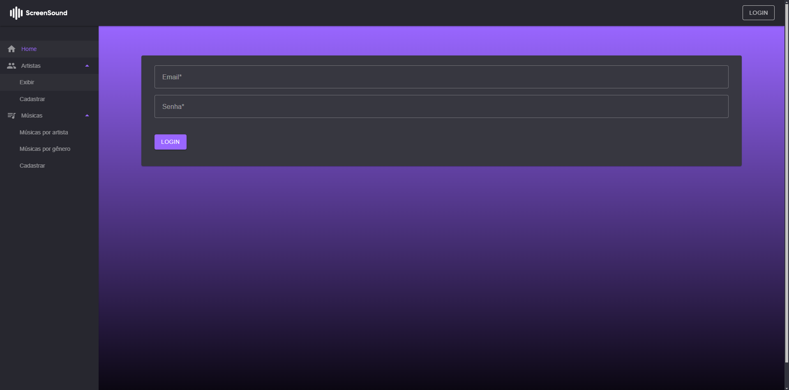
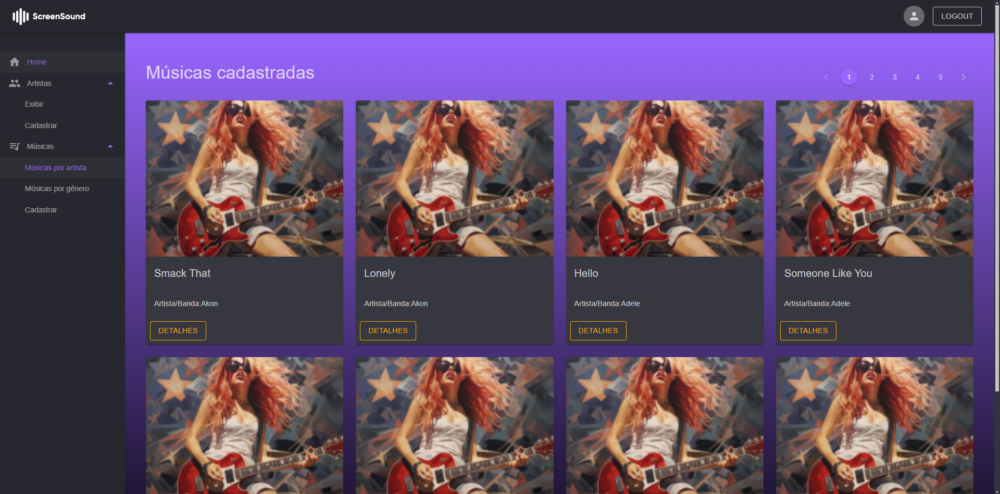
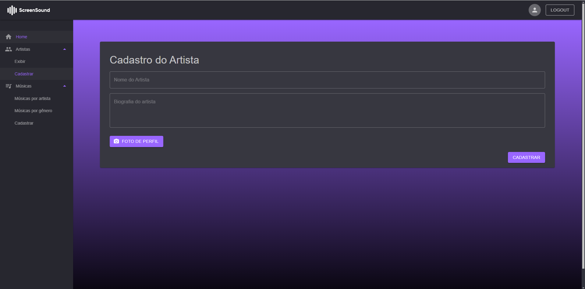
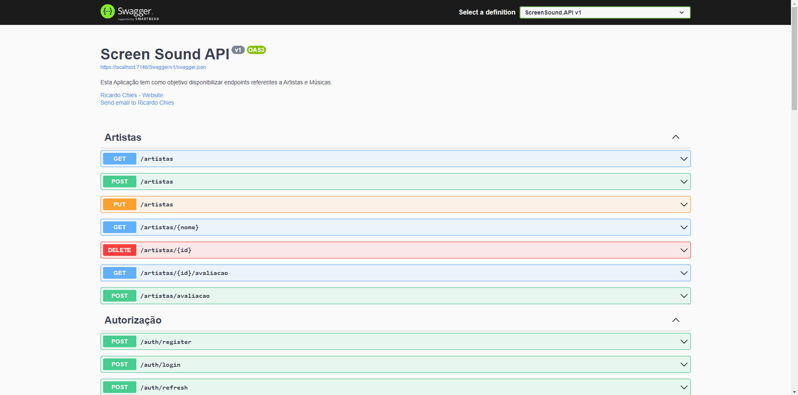

# ScreenSound

O ScreenSound é uma aplicação que gerencia informações sobre músicas e artistas, permitindo aos usuários explorar e avaliar conteúdos musicais.

## Estrutura do Projeto

- ScreenSound.API: Projeto API
- ScreenSound.Data: Projeto de acesso a dados
- ScreenSound.Models: Projeto contendo as entidades do domínio
- ScreenSound.Web: Projeto FrontEnd Blazor

## Funcionalidades

- Gerenciar artistas
- Gerenciar músicas
- Gerenciar gêneros musicais
- Relacionar músicas com artistas e gêneros
- Classificar Artistas

## Tecnologias Utilizadas

- ASP.NET Core 8.0
- Entity Framework Core 7.0
- MySQL
- Swagger para documentação da API
- Migrations
- Clean Architecture
- Identity
- Blazor WebAssembly

## Pré-requisitos

Antes de começar, certifique-se de ter as seguintes ferramentas instaladas em sua máquina:

- [.NET SDK 8.0](https://dotnet.microsoft.com/download/dotnet/8.0)
- [MySQL Server](https://dev.mysql.com/downloads/mysql/)

## Clonando o Repositório

Para clonar o repositório, execute o seguinte comando:

```bash
git clone https://github.com/ricardo-chiues/screen-sound.git
```

## Configurando

1. Navegue até o diretório padrão do projeto

```
cd screen-sound
```

2. Restaure as dependências do projeto

```
dotnet restore
```

3. Configure a string de conexão com o banco de dados MySql no arquivo 'appsettings.json' localizado no diretório 'ScreenSound.API'

4. Crie as migrações e atualize o banco de dados:

```
cd ScreenSound.API
dotnet ef migrations add InitialCreate
dotnet ef database update
```

Ou utilizando o Visual Studio, selecione como projeto inicializador ScreenSound.API
Abra o gerenciador de pacotes do nuget, selecione em projeto padrão ScreenSound.Data

Utilize o comando:
```
Update-Database
```

## Executando a aplicação

Para executar a API documentada com Swagger utilize o comando:

```
dotnet run --project ScreenSound.API
```

Acesse a porta informada no console em seu navegador adicionando o endpoint do swagger
Ex: https://localhost:7146/Swagger/index.html

Para executar o projeto Web utilize o comando:

```
dotnet run --project ScreenSound.Web
```

Acesse a porta informada no console em seu navegador
Ex: http://localhost:5036

Caso tenha o Visual Studio instalado em seu computador, a maneira mais simples é abrir a solution do projeto e iniciar ambos os projetos configurando 'Vários projetos de inicialização' e selecionando ScreenSound.API e ScreenSound.Web

Para consumir o projeto web primeiro é necessário criar um usuário pela API e realizar o login pelo projeto Web.

## Layout do Projeto
<p align="center">
  
  
  
  
  
</p>

## Autor
José Ricardo Chies Gonçalves

LinkedIn:
https://www.linkedin.com/in/ricardo-chies-087557216/

E-mail:
chies.dev@gmail.com
